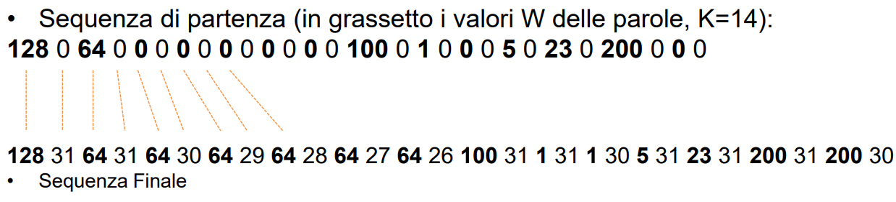
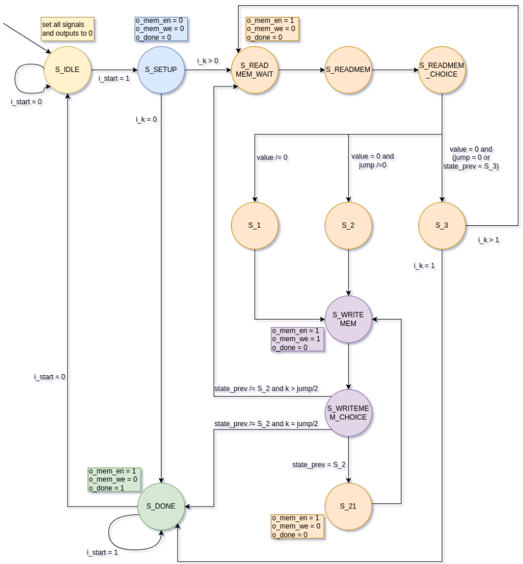

<h2 align="center">Progetto Finale Reti Logiche 2023/2024 - Politecnico di Milano</h2>

Si chiede di implementare un modulo HW (descritto in VHDL) che si interfacci con una memoria e che rispetti le indicazioni riportate nella seguente specifica:
Il sistema legge un messaggio costituito da una sequenza di K parole il cui valore è tra 0 e 255.
* Il valore 0 all’interno della sequenza deve essere considerato non come valore ma come informazione “il valore non è specificato”.
* La sequenza di K parole da elaborare è memorizzata a partire da un indirizzo specificato (ADD), ogni 2 byte (e.g. ADD, ADD+2, ADD+4, …, ADD+2*(K-1)). Il byte mancante dovrà essere completato come descritto in seguito.
* Il modulo da progettare ha il compito di completare la sequenza, sostituendo gli zero laddove presenti con l’ultimo valore letto diverso da zero, ed inserendo un valore di “credibilità” C, nel byte mancante, per ogni valore della sequenza.
* La sostituzione degli zero avviene copiando l’ultimo valore valido (non zero) letto precedente e appartenente alla sequenza.
* Il valore di credibilità C è pari a 31 ogni volta che il valore della sequenza è non zero, mentre viene decrementato (minimo C=0) rispetto al valore precedente ogni volta che si incontra uno zero
* Un segnale di START (con associato ADD e K) determina la richiesta di codifica, un segnale DONE la sua fine

  

## Soluzione

La macchina progettata è stata progettata utilizzando gli stati mostrati in figura:

  

Per una più dettagliata descrizione riguardo l'implementazione, può essere consultata la documentazione del progetto al seguente [link](https://github.com/DiegoLecchi/Progetto_RL/blob/main/final_delivery/10681646_10736595.pdf).

Se, invece, si è interessati al codice vero e proprio del componente, può essere consultato il file VHDL al seguente [link](https://github.com/DiegoLecchi/Progetto_RL/blob/main/final_delivery/10681646_10736595.vhd).

<!-- CONTACT -->
## Membri del Gruppo 👥

* [Diego Lecchi](https://github.com/DiegoLecchi)
* [Andrea Mastroberti](https://github.com/dre-droid)
